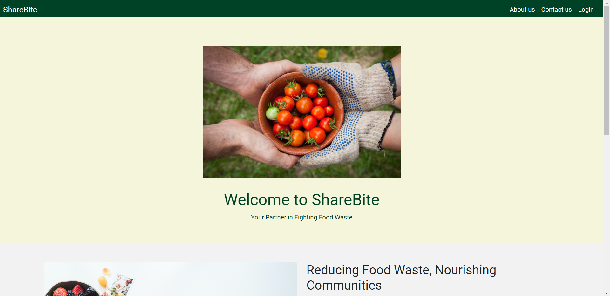
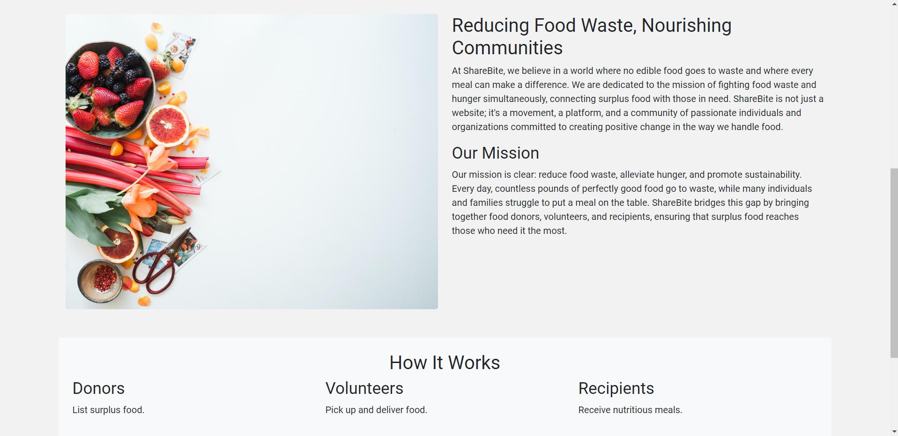
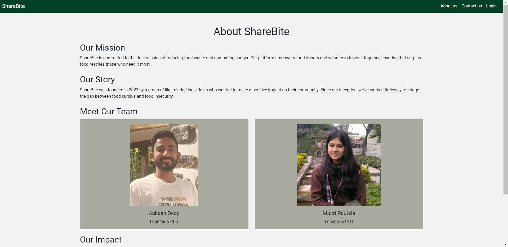
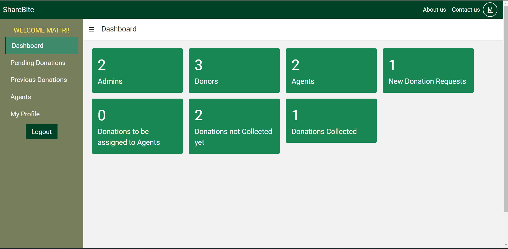
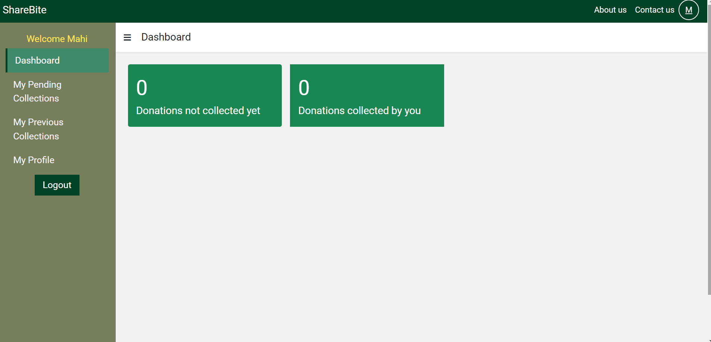
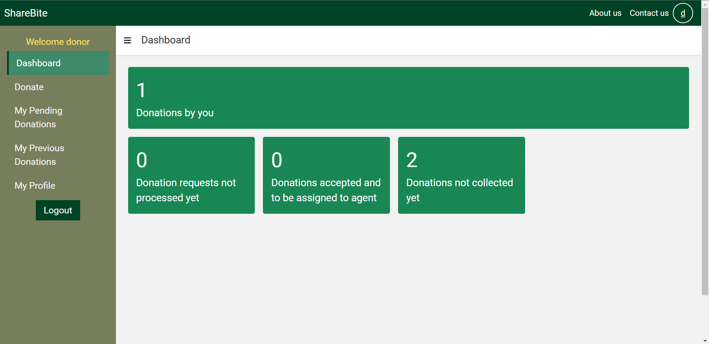

# ShareBite

ShareBite is a platform that empowers food donors and volunteers to work together, ensuring that surplus food reaches those who need it most.

## How ShareBite Looks like

Homepage



About Us

Admin Dashboard


Agent/Volunteer Dashboard


Donor Dashboard


## Table of Contents

- [Features](#features)
- [Technologies used](#technologies-used)
- [npm packages used](#npm-packages-used)
- [Prerequisites](#prerequisites)
- [Installation and setup](#installation-and-setup)
- [Useful Links](#useful-links)
- [Contact](#contact)

## Features

- The system consists of three types of users: admins, donors and agents.
- Admins: They control all the activities and accept/reject donations and select agents.
- Donors: They are the driving users of the application who donate food.
- Agents: They are responsible for collecting food from homes of food donors.
- Each user should have an account.
- Every user also have a dashboard where they can view several things in short summary.
- The application provides signup, login and logout functionalities.

### Donor Features

- Donors make the donation request for food with basic details.
- Donors' donation requests can be accepted or rejected and the status can be easily tracked by them.
- Donors can view their current incomplete donations (if any).
- Donors can also view all their past donations.
- Donors can update their profile.

### Admin Features

- Admins receive all the requests made by donors.
- Admins can accept or reject the donation requests depending upon the details provided by a donor.
- If accepted, admins can assign an agent to a donation for collecting donation from the donor's home.
- Admins can view all the pending donations along with status.
- Admins can view all the donations that they have received.
- Admins can also view all the agents in the application.
- Admins can update their profile.

### Agent Features

- Agents will receive notifications from admins to collect food from donor's homes.
- Agents can mark their collection upon collection of food from donor's home.
- Agents can also view all those food donations which have been collected by them previously.
- Agents can update their profile.

## Technologies used

- HTML
- CSS
- Bootstrap
- Javascript
- Node.js
- Express.js
- Mongodb
- ejs

## npm packages used

- express
- ejs
- express-ejs-layouts
- mongoose
- express-session
- bcryptjs
- passport
- passport-local
- connect-flash
- method-override
- dotenv

## Prerequisites

For running the application:

- Node.js must be installed on the system.
- You should have a MongoDB database.
- You should have a code editor (preferred: VS Code)

## Installation and Setup

1. Install all the dependencies
   ```sh
   npm install
   ```
2. Create a file named ".env" and enter the following credentials:
   ```js
   MONGO_URI = yourmongouri;
   ```
3. Create img1 folder under assets folder and add Author Picture
4. Run the web application
   ```sh
   npm start
   ```
5. Open http://localhost:5000
6. You need to first signup and then login to run the application.

## Authors

-Aakash(https://github.com/Aakashdeep3708) & Maitri( https://github.com/20maitrti)

